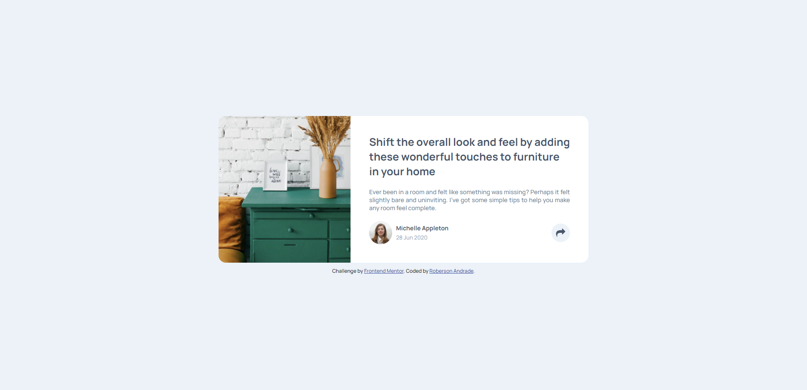
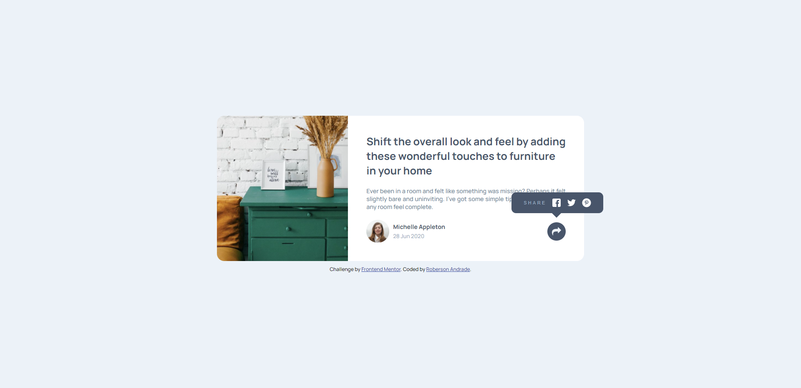
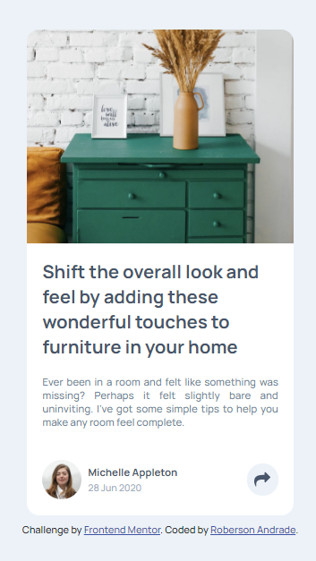
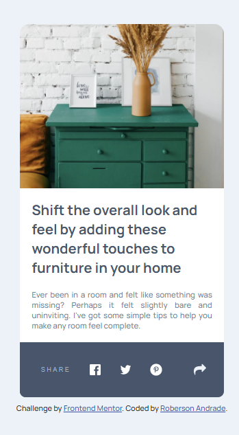

# Frontend Mentor - Article preview component solution

This is a solution to the [Article preview component challenge on Frontend Mentor](https://www.frontendmentor.io/challenges/article-preview-component-dYBN_pYFT). Frontend Mentor challenges help you improve your coding skills by building realistic projects. 

## Table of contents

- [Overview](#overview)
  - [The challenge](#the-challenge)
  - [Screenshot](#screenshot)
  - [Links](#links)
- [My process](#my-process)
  - [Built with](#built-with)
- [Author](#author)

## Overview

### The challenge

Users should be able to:

- View the optimal layout for the component depending on their device's screen size
- See the social media share links when they click the share icon

### Screenshot

### Links

- Solution URL: [Add solution URL here](https://github.com/Roberson-Andrade/Frontend-Mentor-Solutions/tree/master/article-preview-component-master)
- Live Site URL: [Add live site URL here](https://roberson-andrade.github.io/Frontend-Mentor-Solutions/article-preview-component-master/)

## My process

### Built with

- Semantic HTML5 markup
- CSS custom properties
- Flexbox

## Author

- Frontend Mentor - [@Roberson-Andrade](https://www.frontendmentor.io/profile/Roberson-Andrade)
- Twitter - [@RobersonAndrade](https://twitter.com/RobersonAndrad)
- Linkedin - [Roberson-Andrade] (https://www.linkedin.com/in/roberson-andrade-a79007197/)
- GitHub - [@Roberson-Andrade] (https://github.com/Roberson-Andrade)

