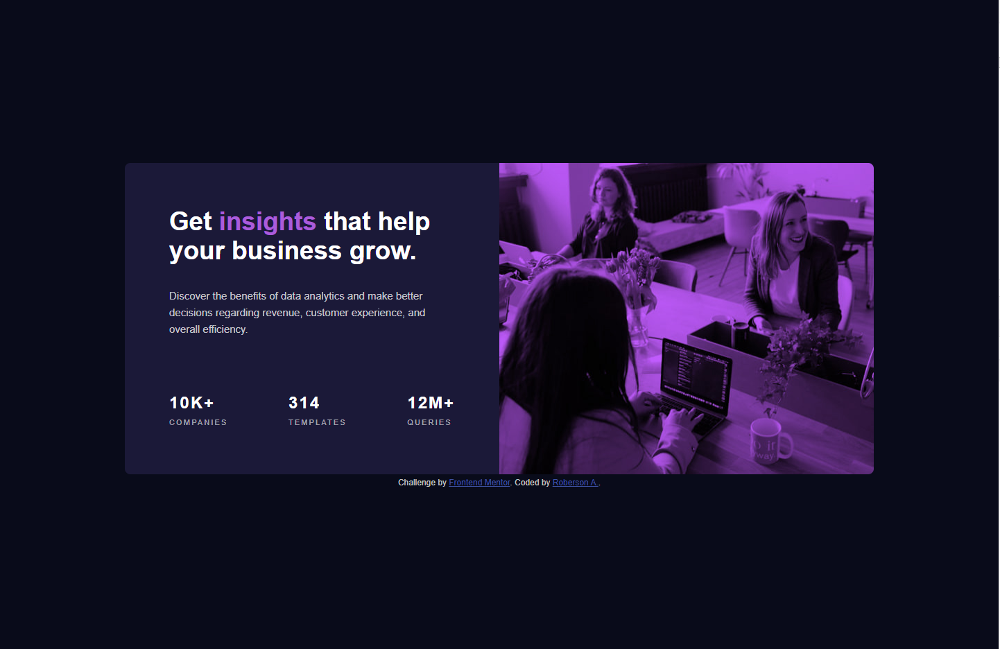
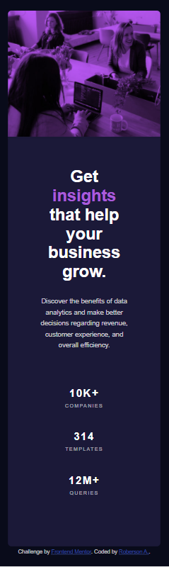

# Frontend Mentor - Stats preview card component solution

This is a solution to the [Stats preview card component challenge on Frontend Mentor](https://www.frontendmentor.io/challenges/stats-preview-card-component-8JqbgoU62). Frontend Mentor challenges help you improve your coding skills by building realistic projects. 

## Table of contents

- [Overview](#overview)
  - [The challenge](#the-challenge)
  - [Screenshot](#screenshot)
  - [Links](#links)
- [My process](#my-process)
  - [Built with](#built-with)
- [Author](#author)

**Note: Delete this note and update the table of contents based on what sections you keep.**

## Overview

### The challenge

Users should be able to:

- View the optimal layout depending on their device's screen size

### Screenshot

### Links

- Solution URL: [Solution](https://roberson-andrade.github.io/Frontend-Mentor-Solutions/stats%20preview%20card%20component%20main/)

## My process

### Built with

- Semantic HTML5 markup
- CSS custom properties
- Flexbox

## Author

- Frontend Mentor - [@Roberson-Andrade](https://www.frontendmentor.io/profile/Roberson-Andrade)
- Twitter - [@RobersonAndrade](https://twitter.com/RobersonAndrad)
- Linkedin - [Roberson-Andrade] (https://www.linkedin.com/in/roberson-andrade-a79007197/)
- GitHub - [@Roberson-Andrade] (https://github.com/Roberson-Andrade)
